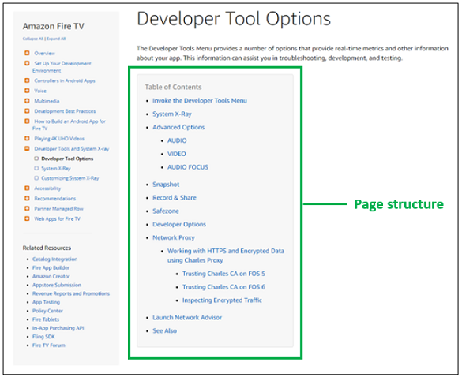

# Content Structure

## What is Content Structure? 

Content structure refers to the **order** and **organization** of conceptual, procedural, and/or reference information within technical content: 

* well-ordered content expresses a logical sequence by which the subject matter is most efficiently learned
* well-organized content reflects a logical hierarchy that cascades from the most general information to the most specific information.

A good way to visually understand order and organization is to look at a standard table of contents for a technical book -- the vertical orientation is the order, and the horizontal orientation (i.e., indented topics below other topics) is the organization:


Content structure design principles apply to **all levels of content**:

 * the order and organization of topics under a documentation subject
 * the order and organization of subtopics (within a topic)
 * the order and organization of page documents within a topic or subtopic
 * the order and organization of sections in a page document
 * the order and organization of sentences in technical prose.
 
To illustrate, a single webpage document, such as the Amazon Fire TV [Developer Tool Options page](https://developer.amazon.com/docs/fire-tv/system-xray-developer-tools.html) has its own contents list, which communicates both page-level order and organization:



<p style="font-size:10px">As you may have noticed, this Tutti page itself also has its own contents list.</p>

Examples of good and bad structure at all content levels are provided on this page.

## Benefits of Good Content Structure

For documentation developers, technical content with good structure is:

* easier to write
* easier to maintain
* easier to collaborate on.

For documentation users, content with good structure is:

* easier to discover (via search and menu navigation)
* easier to access (i.e., scan, read, and understand). 

If you're beginning a documentation project, or if you're concerned that your current content might not have good structure, this page will help you structure your content properly.

## Topic Structure

### Bad Topic Order

The following topic order is poor:

```
Python Programming
  Troubleshoot Python Errors
  Create a Python Program
  Install Python
  What is Python?
```

This order fails to express a logical sequence for learning the subject. You won't troubleshoot a Python error before you have a Python program. And you won't create a Python program before you install Python. (Also, it's probably a good idea to know what Python is before you install and use it.)

### Good Topic Order

The following topic order is much better:

```
Python Programming
  What is Python? 
  Install Python
  Create a Python Program
  Troubleshoot Python Errors
```

Make sure you arrange the major topics in your documentation in the order in which a new user will most easily learn your subject matter.

### Bad Topic Organization

The following flat list doesn't imply any hierarchical relationships within the content, which actually obscures the information: 

```
Linux
Ubuntu
Disco Dingo
Bionic Beaver
Xenial Xerus
Trusty Tahr
Linux Mint
Tessa
Tara
Sylvia
Sonya
```

A reader unfamiliar with the subject matter might believe that this is a list of eleven different operating systems.

### Good Topic Organization

Via indentation alone, the following topic organization communicates a parent-child hierarchy: 

```
Linux
  Ubuntu
    Disco Dingo
    Bionic Beaver
    Xenial Xerus
    Trusty Tahr
  Linux Mint
    Tessa
    Tara
    Sylvia
    Sonya
```

A reader completely unfamiliar with the subject matter can now infer (at minimum) that Ubuntu and Linux Mint are two types of Linux, and that four types of Ubuntu and four types of Linux Mint will be covered by the content.

> **Note**: The examples above not only apply to the order and organization of topics, but also to subtopics within a topic and the documents (pages) listed within a topic. That is, order subtopics and the pages within topics in the same kind of logical sequence for learning, and organize specific "child" subtopics and pages under more general "parent" subtopics and pages. 

To help facilitate content authoring and to promote content consistency across Tutti, see the <u>Recommended Topic Structure</u>.

## Page Content Structure

As seen in the Amazon Fire TV webpage example shown above (and as seen on this page itself), page content should be ordered and organized just as topics and lists of pages within a topic are ordered and organized. 

On a page, what needs to be ordered and organized are all the discrete "chunks" of information, each of which is about some distinct concept, procedure, or reference information. 

Identify each discrete information chunk that you need on your page, then order them in a logical sequence that makes the information easiest to learn, and organize them in levels from the most general information to the most specific information. 

It might be useful to think of nested containers of information on a page. For example, conceptual information would be ordered and organized as nested information containers like the following:


And procedural information would be ordered and organized as nested information containers like the following:


In a document structure, the best way to accomplish this information nesting is by properly using **headings**.

### Headings

Headings in markup languages such as HTML, Markdown, and reStructuredText weren't created for the purpose of visually styling a document. Their purpose is to delineate a logical structure of information from the most general level to increasingly more specific levels. For example:

```
<h1>Installing Python</h1>
  <h2>Installing Python on Windows</h2>
  <h2>Installing Python on Mac OS X</h2>
  <h2>Installing Python on Linux</h2>
    <h3>Installing Python on RHEL</h3>
    <h3>Installing Python on Ubuntu</h3>
```

When heading levels are used properly with well-written heading text at each level, both human readers and search engines can look at a document and quickly, easily, and accurately determine:

* The content included under each heading
* "Parent/child" relationships between content under adjacent headings of different levels
* How the content under each heading logically follows from content under previous headings.

The line breaks, white space, and information "chunking" created by headings also increase the readability and visual appeal of a page. 

Headings at all levels must clearly describe in a few words the content under that heading:

* If the content is conceptual (i.e., it describes an object or concept), the heading should contain the name of the concept
* If the content is procedural (i.e., it tells the reader how to do something), the heading should communicate the goal or objective of the procedure.

A page should have one first-degree heading (h1), with the text being a clear title for the subject of the page. 

## Prose Structure

Each sentence within technical content should clearly express a relevant piece of information. These sentences should be strung together into technical prose following the principles of order and organization:

* the order of sentences should follow a logical sequence that makes the overall meaning easiest to construct in the reader's mind 
* the organization of sentences should progress from a general concept or objective to more specific details about that general concept or objective.

### Bad Sentence Order

The following sentences in this "Keyboard Focus" section are ordered poorly:

<hr>
<i><b>Keyboard Focus</b></i>

<p><i>Only one interactive UI element can take keyboard focus at a time. Users can't interact with a UI element via the keyboard until the element has keyboard focus. The sequence that keyboard focus follows through a screen is called the "Tab order". Users move keyboard focus from one interactive element to the next interactive element on a screen by hitting the Tab key.</i></p>
  
<p><i>A UI element that has keyboard focus is visually marked in some way (e.g., a blinking cursor in an entry field, a dotted rectangle around a check box, etc.). Keyboard focus is the assignment of the UI element that can currently receive keyboard input from the user (e.g., typing into an entry field, hitting the spacebar to select a check box, etc.).</i></p>
<hr>

This sentence order doesn't begin by defining what keyboard focus is. It seems to assume that the reader already knows, which is an unwise assumption. However, the last sentence finally *does* define keyboard focus. But by then, it's too late for a definition, since the term has already been used five times already. (And, if the reader is assumed to already know what it is, why define it at all?) 

Instead, this poorly ordered passage begins by describing various aspects of keyboard focus that seem to be in an arbitrary order. This slows down the reading and makes it more difficult to retain the information. In many cases, users will read a section like this more than once before retaining the information because they will be reorganizing the random sequence of information in their minds into something more logical.

### Good Sentence Order

The exact same sentences are merely reordered in this "Keyboard Focus" section, making it much easier to read and understand:

<hr>
<i><b>Keyboard Focus</b></i>

<p><i>Keyboard focus is the assignment of the UI element that can currently receive keyboard input from the user (e.g., typing into an entry field, hitting the spacebar to select a check box, etc.). A UI element that has keyboard focus is visually marked in some way (e.g., a blinking cursor in an entry field, a dotted rectangle around a check box, etc.).</i></p> 

<p><i>Users can't interact with a UI element via the keyboard until the element has keyboard focus. Only one interactive UI element can take keyboard focus at a time. Users move keyboard focus from one interactive element to the next interactive element on a screen by hitting the Tab key. The sequence that keyboard focus follows through a screen is called the "Tab order."</i></p>
<hr>

This sentence order begins with what keyboard focus is and then how to recognize it. It then moves on to describe qualities of keyboard focus (which are subordinate to the concept of keyboard focus itself, a hierarchical progression from general to more specific information).

### Weak Sentence Organization

The following sentence organization doesn't quickly and clearly communicate its essential information:

<hr />

*In addition to the standard functionality in the GtkRealBin class, you can use custom APIs with a reusable component. The `Designer.create_property()` API creates a custom property on the reusable component. `Designer.create_function()` creates a custom method on the reusable component. Use `Designer.create_signal()` to create a custom signal on the reusable component.*

<hr />
Readers must read the entire paragraph in full to acquire its overall meaning. It's virtually impossible to quickly scan this paragraph to comprehend its essential information.

### Strong Sentence Organization

Conversely, readers can scan and understand the following content much more quickly, simply because of its superior organization:  

<hr />

*You can use the following custom APIs with a reusable component, in addition to the standard functionality in the GtkRealBin class:*

* *`Designer.create_property()` creates a custom property on the reusable component*
* *`Designer.create_function()` creates a custom method on the reusable component*
* *`Designer.create_signal()` creates a custom signal on the reusable component.*

<hr />

This example uses an unordered list to organize its content. For more information, see [Using Lists to Organize Technical Prose](#using-lists-to-organize-technical-prose).

## Using Lists to Organize Technical Prose

As seen in the [Strong Sentence Organization](#strong-sentence-organization) example earlier, you can use unordered (bullet) lists and ordered (numbered) lists to structure your content at the prose level.

Note the indentation of the list items in both types of list. As with higher levels of content organization, this creates a visual indication of a parent-child relationship between the lead sentence (parent) and each list item (child).  

When used properly, ordered and unordered lists can help users quickly scan and comprehend page content. But like all other aspects of content authoring, misusing lists can hurt your content more than help it.

### Unordered (Bullet) Lists

Use an unordered list (often called a "bullet list") to present a number of related items consecutively when there is no explicit order of sequence or importance in the items. 

For example:
<hr>

*Image files can be any of the following:*

* *GIF*
* *PNG*
* *JPEG*
<hr>

Not:

<hr>

<i><p>Image files can be any of the following:</p></i>

<i><ol>
<li>GIF</li>
<li>PNG</li>
<li>JPEG</li>
</ol></i>
<hr>

In other words, don't use numbers in a list if the numbers don't mean anything. A good test is to flip the order of the items in a list. If that doesn't affect the meaning of the list (as it wouldn't in the example above), then the numbers don't mean anything, and your list should be unordered (i.e., use bullets).

Don't use bullets as mere decorations or to mark new paragraphs. The purpose of bullets is to delineate each distinct item in an unordered list structure. This also means that you should never have a one-bullet list, since a "list" of one item doesn't make structural sense.

### Ordered (Numbered) Lists

Use an ordered list (often called a "numbered list") to present two or more related items consecutively in an explicit order of sequence or importance. That is, the numbers (or letters or numerals) in the list mean something. 

For example:

<hr>
<i><p>To renew administrator privileges on your PC, do the following:</p>

<ol>
<li>Double-click the Toolkit icon on your desktop</li>
<li>Enter your Username and Password and hit Enter</li>
<li>Click the My PCs icon on the left side</li>
<li>Click the "Renew" link next to LEVEL: Admin.</li>
</ol></i>
<hr>

Not:

<hr>
<i><p>To renew administrator privileges on your PC, do the following:</p>
<ul>
<li>Double-click the Toolkit icon on your desktop</li>
<li>Enter your Username and Password and hit Enter</li>
<li>Click the My PCs icon on the left side</li>
<li>Click the "Renew" link next to LEVEL: Admin.</li>
  </ul></i><hr>

As seen above, both types of lists should be preceeded by a sentence that describes or introduces the list.
